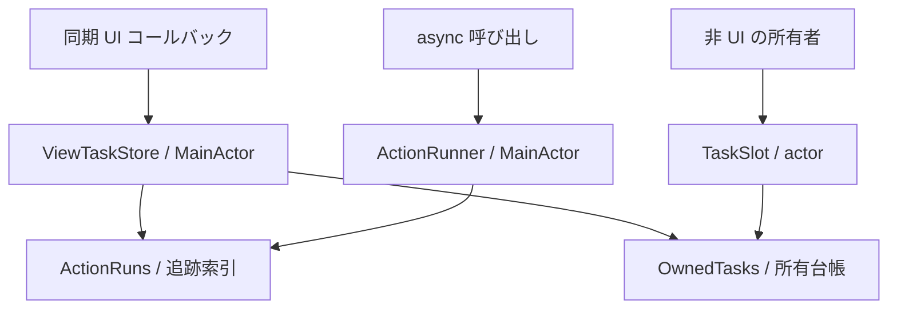

# アーキテクチャ

Tasking は、task の所有、Action の重複制御、アプリの状態管理をそれぞれ独立した責務とする。
利用者は処理を始める場所と必要な所有スコープから型を選ぶ。

## 公開する型と実行場所

| 型 | 実行場所 | 入力と出力 | 管理するもの |
|---|---|---|---|
| `ViewTaskStore` | MainActor | 同期の `start` → `TaskStartOutcome` | 作成した task、Action の追跡、lifetime、重複方針 |
| `ActionRunner` | MainActor | async の `run` → `ActionOutcome<Success>` | 呼び出し元 task 内の Action の追跡と最終結果 |
| `TaskSlot` | 独立した actor | `replace` → 受付結果の `Bool` | active task と、終了を待つ置換済み task |

Store の operation は `@MainActor @Sendable` な throwing closure、Runner も同じ隔離で
`Sendable` な成功値を返す。Slot の operation は `@Sendable` な non-throwing async closure である。
各 operation が受け取る `CancellationContext` は、その時点で実行している task の状態を読む。

Store の開始結果は処理の完了を表さない。業務結果は ViewModel の状態に反映する。
Runner は operation の戻り値・例外を `.succeeded` / `.cancelled` / `.failed` に分類する。
キャンセル要求が出ていても、operation が値を返せば `.succeeded` になる。

## 追跡と所有

**追跡**は、重複判定と `isRunning` / `runningCount` の対象であることを表す。
**所有**は、キャンセルや終了待ちのために task のハンドルを保持することを表す。

Store の run は次の状態を取る。

| 操作・状態 | 追跡索引 | 所有台帳 |
|---|---|---|
| `start` が受理された | 登録する | 登録する |
| `cancel` を要求した | 除去する | 終了まで保持する |
| operation が終了した | 登録が残っていれば除去する | 除去する |
| `close` を呼んだ | 登録内容を保つ | 登録内容を保つ |

したがって、追跡中の run は必ず所有中だが、所有中の run が追跡中とは限らない。
キャンセル直後に `.ignoreNew` で同じ ActionID を開始すると、古い operation と重なることがある。

Slot は最大1つの active task を持つ。`replace` は active task をキャンセルして新しい task を
active にする。置換前の task も終了までは所有するため、実行中の operation 数は1つとは限らない。
Runner は task を所有せず、`run` が復帰するまで Action を追跡する。

## 受付停止と終了待ち

Store / Slot の `close()` は冪等で、受付を恒久的に停止する。再開には新しいインスタンスを使う。
Store は `.skipped(.closed)`、Slot は `false` で拒否し、operation を実行しない。

| 目的 | 呼び出し |
|---|---|
| キャンセル後も所有者を再利用する | Store の `cancel(...)` / `cancelAll()`、Slot の `cancel()` |
| 受け付け済みの処理を自然完了させる | `close()` の後に `waitForIdle()` |
| 受付停止・キャンセル・実終了待ちを行う | `cancelAndWaitForIdle()` |
| Store の特定の実行を待つ | `awaitCompletion(of: run)` |

`cancelAndWaitForIdle()` は最初の suspension より前に受付を閉じ、キャンセルを要求する。
受付が開いたままの `waitForIdle()` は、待機中に開始された task も対象にする。
待機中は actor に再入できるため、復帰のたびに所有台帳から待つ task を選び直す。

待機する側の task をキャンセルしても、所有中の task はキャンセルされず、待機も中断しない。
operation がキャンセルに協調しなければ、受付を閉じても終了待ちは完了しない。

## 内部構造

- `ActionRuns<Metadata>` は `[ActionID: [ActionRunID: Metadata]]` を持つ。
  Store は lifetime、Runner は `Void` を metadata として格納する。
- `OwnedTasks<Key>` は task handle と `TaskOwnership` を保持する TaskingCore の package 内部型である。
  Store は `ActionRun`、Slot は `TaskOwnership` をキーにする。
- task 作成、actor 隔離、受付方針、待機ループは Store / Slot が担当する。
  内部台帳の可変アクセスを suspension をまたいで保持しない。
- run の照会・キャンセル・完了待ちは、ActionID と ActionRunID の組で識別する。
  古い run の終了は、その run だけを除去する。

Store は operation 開始前に登録を完了する。Slot の `replace` は suspension を含まず、
終了処理が slot actor に入る前に登録を完了する。

### 参照と自己待機

内部 task は Store / Slot を弱参照する。Store のエラー observer は task に直接捕捉せず、
生存中の Store から取得する。利用側の operation が所有者を強参照すると循環が作れるため、
長い処理には必要な依存だけを捕捉し、所有者への状態反映は弱参照で行う。

`TaskOwnership` は空の immutable な参照型で、所有台帳と TaskLocal の集合が保持する。
継承先に marker が残る間は参照のアドレスが再利用されず、所有者の寿命にも依存しない。

所有中の operation やその構造化子 task から、自分の終了を待つことは契約違反である。
Debug は assertion、Release は継承した所有文脈に属する task を除外する。
この検出は任意の task 間の依存グラフを扱わない。operation 内の並行処理には
`async let` / task group を使う。

## テスト方針

テストは公開契約を Swift Testing で表す。

| 契約 | 観測するもの |
|---|---|
| 重複方針 | operation / onStart の呼び出し、返る outcome、run ごとの追跡 |
| キャンセル | operation 内の CancellationContext、実終了時の副作用 |
| 終了待ち | gate を開く前は待機し、復帰時には処理が完了していること |
| 解放 | weak 参照と capture の解放、所有者の解放によるキャンセル要求 |
| 結果の世代管理 | 古い処理を新しい処理より後に完了させても状態が上書きされないこと |

`Gate` で operation の到達と再開を制御し、完了 API で終了を確認する。
MainActor の `Checkpoint` と Slot の isolated parameter により、待機開始を同じ actor 上で調整する。
`isRunning == false` を終了の代用にせず、短い sleep や内部辞書への reflection に依存しない。

Debug / Release / Thread Sanitizer と strict concurrency の検査を行う。
性能は通常テストの固定時間閾値にせず、独立した Release ベンチマークで評価する。

## 関連資料

- [用語集](glossary.md): 値型と状態の定義
- [ライフタイムと所有構成](lifetimes.md): 所有者の配置と解放
- [性能特性](performance.md): 操作ごとの計算量と測定条件
- [設計判断一覧](README.md#設計判断adr): 各判断の根拠と制約
