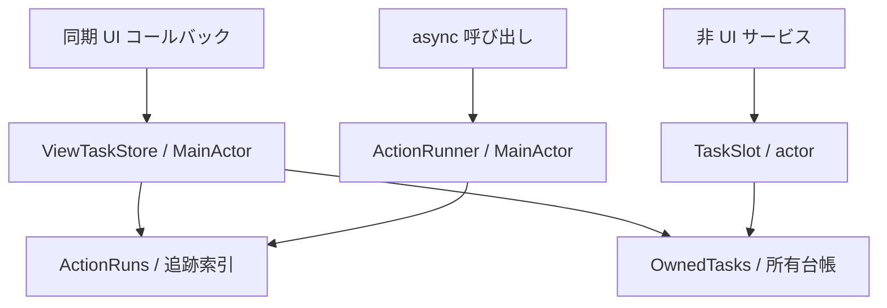

# アーキテクチャ

Tasking は、**タスクの所有**、**Action の実行制御**、**アプリケーションの状態管理**を分ける。
ライブラリが扱うのはタスクと実行の管理であり、保存結果・進捗・エラー表示などの業務状態は利用側が持つ。
用語の定義は [用語集](glossary.md) を参照する。

## パッケージと公開する型

`swift-tasking` は、外部依存を持たない Swift package である。
`TaskingCore` は非 UI のタスク所有を提供し、`Tasking` はそれに依存して MainActor 向けの API を提供する。
両モジュールの `CancellationContext` は同じ型であり、`Tasking` では公開 typealias として扱う。

| product | 型 | 処理を実行するタスク | 管理する状態 |
|---|---|---|---|
| `Tasking` | `ViewTaskStore` | Store が作成する | 受付、Action の追跡、寿命ラベル、タスクの所有 |
| `Tasking` | `ActionRunner` | 呼び出し元のタスク | Action の追跡と終了結果 |
| `TaskingCore` | `TaskSlot` | Slot が作成する | 受付、アクティブなタスク、タスクの所有 |

Store と Runner は MainActor に隔離する。Slot は独立した actor である。
Store と Runner の処理本体は `@MainActor @Sendable` な async throws クロージャで、
Store は `Void`、Runner は `Sendable` な成功値を返す。
Slot の処理本体は `@Sendable` な async クロージャで、エラーを外へ送出しない。

## ViewTaskStore の状態と契約

Store は、受付が開いているかを表す状態と、実行ごとの追跡・所有を持つ。
**追跡**は重複判定と照会の対象、**所有**はキャンセル要求と終了待ちの対象である。

| 操作 | 受付 | 対象の追跡 | 対象の所有 |
|---|---|---|---|
| 受理した `start` | 開いたまま | 追加する | 作成したタスクを追加する |
| `cancel(run)` / `cancel(id:)` / `cancel(lifetime:)` | 変えない | 該当する実行を除く | キャンセルを要求し、終了まで保持する |
| `cancelAll()` | 変えない | すべて除く | 全タスクにキャンセルを要求し、終了まで保持する |
| 処理本体の終了 | 変えない | 該当する実行を除く | 該当するタスクを除く |
| `close()` | 閉じる | 変えない | 変えない |

### 開始と重複制御

`start` は処理を開始する前に追跡を登録し、受付結果を同期的に返す。
同じ ActionID に対する方針は、`.ignoreNew`・`.cancelExisting`・`.allowConcurrent` から選ぶ。
寿命ラベルが異なっていても、同じ ActionID は重複判定の対象になる。

受付が閉じていれば、重複方針を調べる前に `.skipped(.closed)` を返す。
`.ignoreNew` による拒否は `.skipped(.alreadyRunning)`、受理した場合は `.started(ActionRun)` となる。
拒否した要求の処理本体は呼ばない。

キャンセルで追跡から外れた実行は、`.ignoreNew` の重複判定に含めない。
`.cancelExisting` も古い処理の終了を待たずに開始する。
どちらも、実際の処理や副作用の直列実行を保証するものではない。

### エラーの扱い

業務上の失敗は処理本体の中で回復するか、ViewModel の状態に反映する。
Store は正常な return と `CancellationError` を終了として扱い、追跡と所有を解除する。
それ以外のエラーは処理の契約違反として、任意の `onUnhandledError` 通知先に報告する。

通知先は MainActor 上で、完了による追跡解除より前に同期的に呼ばれる。
キャンセルで既に追跡から外れた実行は、通知時にも追跡対象外である。
通知先がない場合や Store の解放後は、Debug でアサーションを発生させ、Release では通知しない。

## ActionRunner の契約

`run` は ActionID ごとの追跡を使い、`.ignoreNew` または `.allowConcurrent` で要求を扱う。
受理すると追跡を登録し、同期の `onStart` を呼んでから、呼び出し元のタスクで処理本体を実行する。
拒否した呼び出しでは、`onStart` も処理本体も呼ばない。終了時には追跡を解除する。

| 処理本体の結果 | 返す値 |
|---|---|
| 値を返す | `.succeeded(value)` |
| `CancellationError` を送出する | `.cancelled` |
| それ以外のエラーを送出する | `.failed(ActionFailure)` |
| 重複により受け付けない | `.skipped(.alreadyRunning)` |

キャンセルが要求されていても、値を返した処理は成功になる。
Runner はタスクを作成・所有せず、キャンセルや受付の閉鎖も行わない。
呼び出し元のキャンセル状態と TaskLocal の値は、同じタスクのまま処理本体から参照できる。

## TaskSlot の契約

Slot は、次の差し替えやキャンセルの対象になるタスクを最大1つ持つ。
`replace` はアクティブなタスクにキャンセルを要求し、新しいタスクを作成して `true` を返す。
受付の閉鎖後は処理本体を呼ばずに `false` を返す。

`cancel` はアクティブなタスクにキャンセルを要求し、アクティブな対象を空にする。
差し替え済み・キャンセル済みのタスクも実終了まで所有するため、未終了の処理は複数存在し得る。
デバウンスの時間、再試行、業務エラーの処理、結果の採用、順序はサービス側が定義する。

## キャンセルと終了待ち

すべての処理本体は `CancellationContext` を受け取る。
`check()` と `isCancelled` はアクセス時に実行中のタスクを参照する。
この値を別の `Task {}` に渡してもキャンセルの親子関係は作られない。
処理内の並行実行には `async let` または task group を使う。

| 目的 | API |
|---|---|
| キャンセル後も同じ所有者を使う | Store の `cancel(...)` / `cancelAll()`、Slot の `cancel()` |
| 受付を止め、受理済みの処理を完了させる | `close()` の後に `waitForIdle()` |
| 受付を止め、キャンセルを要求して終了を待つ | `cancelAndWaitForIdle()` |
| Store の1回の実行を待つ | `awaitCompletion(of:)` |

`close()` は終端状態であり、繰り返し呼んでも結果は変わらない。
`cancelAndWaitForIdle()` は最初の中断点より前に受付を閉じ、キャンセルを要求する。
受付が開いたままの `waitForIdle()` は、待機中に受け付けたタスクも待つ。

`awaitCompletion(of:)` はキャンセル済みの実行も待つ。
指定した ActionID と ActionRunID の組を所有していなければ、直ちに戻る。
待機側のキャンセルは、所有する処理をキャンセルせず、待機も中断しない。
終了しない処理があれば、待機も完了しない。

### 自己待機

所有される処理が自分自身の終了を待つことは、構造化子タスクを経由する場合も含めて契約違反である。
TaskLocal に継承される所有文脈を使い、Debug ではアサーションで検出する。
Release の個別待機は直ちに戻り、全体待機はその所有文脈を除いてほかのタスクを待つ。
任意のタスク間にある循環待機を検出する機能ではない。

## 内部構造と不変条件

| 内部型 | 保持する情報 | 利用する型 |
|---|---|---|
| `ActionRuns<Metadata>` | `[ActionID: [ActionRunID: Metadata]]` | Store は寿命ラベル、Runner は `Void` を格納する |
| `OwnedTasks<Key>` | タスクのハンドルと所有識別子 | Store は `ActionRun`、Slot は `TaskOwnership` をキーにする |
| `TaskOwnership` | 等価性を参照の一致で判定する不変の識別子 | 所有台帳と TaskLocal が保持する |

タスクの作成、actor 隔離、受付方針、待機ループは Store・Runner・Slot が担当する。
内部の索引と台帳は、登録・照会・解除の規則を集約する。

- Store の追跡中の実行は必ず所有中である。
- 個別の実行は ActionID と ActionRunID の組で識別する。
- 古い実行の終了は、その実行だけを索引と台帳から除く。
- 所有者の actor 上で終了処理が動く前に、所有台帳への登録を完了する。
- 台帳への可変アクセスを中断点をまたいで保持しない。
- 待機から復帰するたびに台帳を確認し、次に待つタスクを選ぶ。

内部タスクは Store と Slot を弱参照する。エラー通知先はタスクに直接捕捉せず、生存中の Store から取得する。
Store と Slot は解放時に所有中のタスクへキャンセルを要求する。
利用側の処理が所有者を強参照すると解放を妨げるため、長い処理には必要な依存だけを捕捉する。

`TaskOwnership` は所有者から独立した参照であり、TaskLocal に残る間はアドレスが再利用されない。
計算量、照会のコスト、メモリの扱いは [性能特性](performance.md) にまとめる。

## テスト方針

公開契約を Swift Testing で検証する。テストは入力と観測可能な結果から仕様を示す。

| 契約 | 観測点 |
|---|---|
| 受付と重複制御 | 処理本体と `onStart` の呼び出し、受付結果、実行ごとの追跡 |
| キャンセル | 処理本体が読むキャンセル状態と、終了時の副作用 |
| 完了待ち | ゲートを開くまでは待機し、復帰時には対象の処理が完了していること |
| 参照の解放 | 弱参照、捕捉した依存の解放、所有者解放時のキャンセル要求 |
| 状態の世代管理 | 古い処理が後から完了しても、新しい状態を上書きしないこと |

テスト用の `Gate` は処理の到達と再開を制御する。
MainActor の `Checkpoint` と Slot の isolated parameter は、同じ actor 上で待機の開始を観測するために使う。
処理の終了確認には完了 API を使い、追跡状態や短い sleep から終了を推測しない。

- [Store と Runner のテスト](../Tests/TaskingTests)
- [Slot とキャンセル契約のテスト](../Tests/TaskingCoreTests)
- [アプリケーションへの組み込みのテスト](../Examples/TaskingPrototype/Tests/TaskingPrototypeTests)

Debug・Release・Thread Sanitizer と厳密な並行性チェックを実行する。
性能は独立した Release ベンチマークで測定し、正しさのテストに絶対時間のしきい値を置かない。
コマンドは [コントリビューションガイド](../CONTRIBUTING.md)、判断の理由は [設計判断一覧](README.md#設計判断adr) を参照する。
