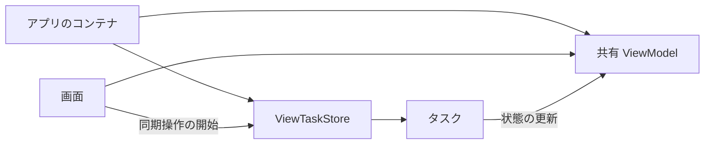

# 寿命と所有構成

タスクを管理できる期間は、Store や Slot を保持する所有者の寿命で決まる。
`ActionLifetime` は Store 内の実行を選ぶラベルであり、所有者の配置やキャンセルのイベントは
アプリケーションが定義する。

## 所有者とラベルを対応させる

| 処理を管理する範囲 | 所有者の例 | ラベル | 終了イベントの例 |
|---|---|---|---|
| 1つの画面 | View または画面用コンテナ | `.screenBound` | 画面の非表示 |
| 1つのシーン | シーンのルート View またはコンテナ | `.sceneBound` | シーンの破棄 |
| アプリ全体 | App が保持するコンテナ | `.appBound` | ログアウト、サービスの終了 |
| 機能固有の処理群 | その処理を管理するコンテナ | 独自の文字列 | 機能の終了 |

`.appBound` を画面所有の Store に付けても、その Store の寿命は延びない。
画面を閉じた後も同期を続けたい場合は、アプリケーション側で Store を保持する。

共有 Store への `cancel(lifetime:)` は、そのラベルを持つすべての追跡中の実行を対象にする。
画面ごとにキャンセルを分ける場合は Store を分けるか、機能固有のラベルまたは `ActionRun` で選択する。

## 画面の表示期間で管理する

次の例は `SwiftUI` と `Tasking` を import した画面で使う。
`SettingsViewModel` はアプリケーション側の型で、`save(cancellation:)` が表示状態と業務エラーを扱う。
[SettingsFeature.swift](../Examples/TaskingPrototype/Sources/TaskingPrototype/SettingsFeature.swift) に完全な実装がある。

```swift
@MainActor
struct EditorView: View {
    @State private var taskStore = ViewTaskStore()
    let viewModel: SettingsViewModel

    var body: some View {
        Button("保存") {
            taskStore.start(id: EditorActions.save, lifetime: .screenBound) { [viewModel] cancellation in
                try await viewModel.save(cancellation: cancellation)
            }
        }
        .onDisappear {
            taskStore.cancel(lifetime: .screenBound)
        }
    }
}

private enum EditorActions {
    static let save: ActionID = "editor.save"
}
```

非表示時は対象をキャンセルし、受付を開いたままにする。これにより、同じ Store を使う再表示でも開始を受け付ける。
キャンセル済みの保存が終了する前に再開始する場合は、ViewModel 側で世代ガードを使う。
`close()` は再開できない終端操作なので、所有者そのものを終了する際に使う。

## シーンごとに管理する

`WindowGroup` の各ルート View に Store を保持すると、ウィンドウごとに所有を分けられる。
子画面には、その Store または必要な操作だけを公開する同期ハンドラを渡す。
シーンのルートが同じでも、独立した終了方針を持つ機能には別の Store を配置できる。

シーンの inactive 化と終了は区別する。システムダイアログや一時的なフォーカス喪失でも inactive になるため、
その時点でキャンセルすべきかは処理の要件で決める。
`scenePhase` を監視する場合は、どの状態変化をどのラベルのキャンセルへ接続するかを明示する。

## アプリ全体で管理する

画面を越えて継続する処理は、Store と表示用の ViewModel をアプリ寿命のコンテナに配置する。
画面はコンテナから同じ ViewModel を受け取り、進行中の処理の状態を表示する。
[AppSyncFeature.swift](../Examples/TaskingPrototype/Sources/TaskingPrototype/AppSyncFeature.swift) では、
`AppTaskContainer` が Store と `SyncViewModel` を所有している。



Store と一緒に ViewModel も保持すると、画面に戻った際に処理と表示の状態が一致する。
実行中の処理が画面を強参照する構成は避ける。

アプリの準備を1回だけ要求する場合は、要求済みのフラグや準備状態をアプリ側で持つ。
`.ignoreNew` は追跡中の重複を拒否する方針であり、完了後の再要求は受け付ける。
失敗後の再試行も、アプリ側の状態遷移として定義する。

システムダイアログを表示する準備処理では、その表示で `scenePhase` が変化することがある。
`.task(id: scenePhase)` に結び付けると、処理自身が起こした状態変化でキャンセルされ得る。
状態変化を開始のきっかけにだけ使い、その後は継続する処理には、アプリ所有の Store が適する。

## 所有者を終了する

| 所有者の扱い | 操作 |
|---|---|
| 同じ所有者を引き続き使う | 必要な対象に `cancel` を要求する |
| 新規受付を止め、受理済みの処理を完了させる | `close()` の後に `waitForIdle()` を呼ぶ |
| 新規受付を止め、キャンセルを要求して終了を確認する | `cancelAndWaitForIdle()` を呼ぶ |

Store と Slot は解放時にもキャンセルを要求する。ただし、解放時点は参照関係で決まり、
キャンセル要求は処理の強制終了ではない。明確な終了時点が必要なら、イベントから終了 API を呼ぶ。
処理が所有者を強参照する場合の循環と対策は [利用レシピ](recipes.md#処理と所有者の参照関係を設計する) を参照する。

`.appBound` は OS によるバックグラウンド実行の保証ではない。
アプリの停止中やプロセス終了後まで継続させる要件には、OS のバックグラウンドタスクや転送 API を使う。
